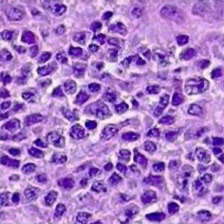
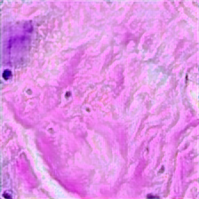
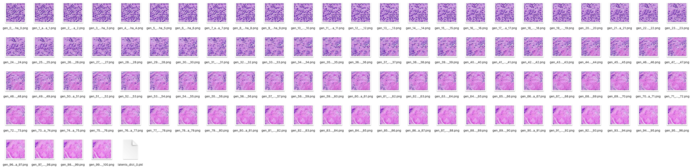

# HistEval
***Pipeline for histology model evaluation and data augmentation under varying data distribution***
```
                      +-------------------+    +-----------------------+    +-----------------------------+
 +---------------+    |  Image Annotation |    | Dataset Constructor   |    | Model Exec                  |
 | Image Dataset +--->+                   +--->+                       +--->+                             |
 +---------------+    |  - HoverNet       |    | - Output diagnostic   |    | - Input model and datasets  |
         ^            |  - ...            |    |   datasets of varying |    | - Output performance        |
         |            |                   |    |   distribution using  |    |   breakdown in terms of     |
         |            +-------------------+    |   annotation          |    |   input dataset composition |
         |                                     +-----------------------+    +-----------------------------+
         |                                                                                 |
         |                                                                                 |
         |                                                                                 |
         |                                                                                 |
         |                                                                                 |
         |                         +-----------------------+                               |
         |                         | Data Augmentation     |                               |
         +-------------------------+                       +<------------------------------+
                                   | - Design augmented    |
                                   |   dataset reflecting  |
                                   |   points of weakness  |
                                   |   for the model       |
                                   +-----------------------+
```
## Pathology-GAN
```
├── CRImage
├── data_manipulation
├── evaluation_automated_sweep
├── find_nearest_neighbors.py
├── generate_fake_samples.py
├── generate_image_interpolation.py
├── high_d_exemplar.pkl
├── low_d_exemplar.pkl
├── high_d_cluster.pkl
├── low_d_cluster.pkl
├── models
├── quantify_model_pipeline.py
├── real_features.py
# ---- pretrained CLAM patch_level=0 instance of PathologyGAN -------------
└── pretrained_checkpoint
    ├── PathologyGAN.ckt.data-00000-of-00001
    ├── PathologyGAN.ckt.index
    ├── PathologyGAN.ckt.meta
    └── checkpoint
#------ To download and add (to mimic original PathologyGAN results) ------
├── dataset (not necessary for generate_image_interpolation.py but may be for other functions)
    └── vgh_nki (download from https://drive.google.com/open?id=1LpgW85CVA48C8LnpmsDMdHqeCGHKsAxw) 
├── data_model_output
    └── PathologyGAN
        └── h224_w224_n3_zdim_200
            └── checkpoints
                ├── PathologyGAN.ckt.data-00000-of-00001 (download tar file from https://figshare.com/s/0a31)
                ├── PathologyGAN.ckt.index
                └── PathologyGAN.ckt.meta
#------------------------------------------------------------------------
└── run_pathgan.py
```
### virtualenv
`requirements.txt` can be used to create an environment via `pip install -r requirements.txt` after creating and activating a blank python (version 3.6.8) virtualenv.

### Usage
#### Synthetic Image Generation
Generating images from a trained model works in the same way as the original PathologyGAN repo (https://github.com/AdalbertoCq/Pathology-GAN).
A call to `generate_fake_samples.py` will be of the following form:
```
python generate_fake_samples.py --num_samples {number of images to generate} --batch_size {batch size} --z_dim {latent dimension - should match the checkpointed model} --checkpoint {path to checkpoint files}/PathologyGAN.ckt --main_path {output directory}
```
Model checkpoints are stored across multiple files so the path provided should point to the `.ckt` file, but it's required that
that file is stored in the same directory as the other checkpoint files.

The image generation method (`generate_samples_from_checkpoint()` in `features.py`) is configured to by default output files containing
dictionaries that store each synthetic sample's corresponding latent vector (each vector being stored under the dictionary key matching
the synthetic image's filename/number). These latents can be used for image interpolation, described below.


#### Image Interpolation
Slight changes to the image generation code allow for generation of example images that interpolate from specified latent vectors.
`generate_image_interpolation.py` can be used to generate a set of images that interpolates between two input latents with the following call:
```
python ./generate_image_interpolation.py --num_samples 100 --z_dim 200 --checkpoint data_model_output/PathologyGAN/h224_w224_n3_zdim_200/checkpoints/PathologyGAN.ckt --exemplar1 low_d_exemplar.pkl --exemplar2 high_d_exemplar.pkl
```
This calls a modified version of the `generate_fake_samples.py` script with added logic to interpolate between specified exemplars. The script
will expect pickled numpy arrays containing vectors of the same dimension as `z_dim`. The exemplars given are the 200-dimensional
representations corresponding to the following images:
high_d_exemplar.pkl             |  low_d_exemplar.pkl
:-------------------------:|:-------------------------:
 | 

... and the python command given above will generate an `evaluation` directory whose contents should be the same as those given in `evaluation_automated_sweep`.


`generate_image_interpolation.py` can also be called with multiple exemplar latents given in both input slots (that is, pickle files containing
numpy arrays of shape `(n, z_dim)` for `n` the number of exemplars given). This will result in the image generation process
drawing random combinations of latents from the two groups and generating new latents by taking weighted averages in the same way as the previous
interpolation example. A call to the script under this mode can be made using the example pickle files `low_d_cluster.pkl` and `high_d_cluster.pkl`:
```
python ./generate_image_interpolation.py --num_samples 100 --z_dim 200 --checkpoint data_model_output/PathologyGAN/h224_w224_n3_zdim_200/checkpoints/PathologyGAN.ckt --exemplar1 low_d_cluster.pkl --exemplar2 high_d_cluster.pkl
```

## Utils
`utils/` directory contains utility scripts for generating and viewing patch datasets.
- `patch_dataset.py`: Generates .h5 patch image dataset files (in a format that can be given to PathologGAN for training) from CLAM output (.svs and .h5 files containing source slides and patch information respectively). Example call:
```
python utils/patch_dataset.py --input_patches {path/to/CLAM/patches} --source_svs_dir {path/to/svs/directory} --output_prefix {path/to/output/directory} --max_dataset_size {num_patches} --shuffle
```
- `view_patches.py`: Generates .png patch images from .h5 dataset file. Example call:
```
python utils/view_patches.py --input_h5 {path/to/patches.h5} --num_patches {int in range (0, dataset_size], or 'all'} --output_dir {path/to/output/directory} 
```

## Evaluation Tools
Scripts for calulating FID and Inception Score provided in `/evaluation_tools/{FID, IS}` respectively (both directories
contain a script with docstrings describing intended use). Code adapted from repos:
- https://github.com/tsc2017/Frechet-Inception-Distance
- https://github.com/tsc2017/Inception-Score

